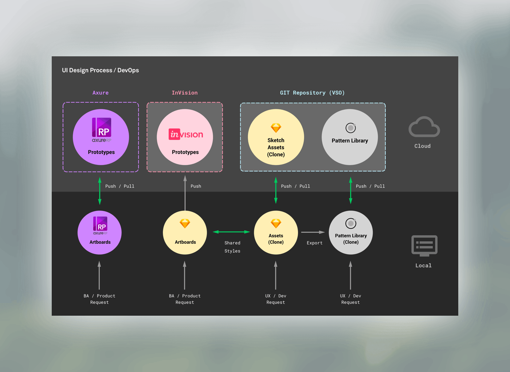
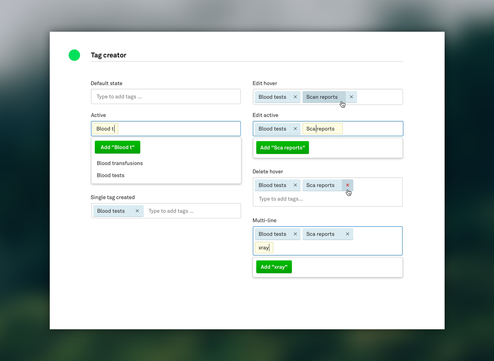
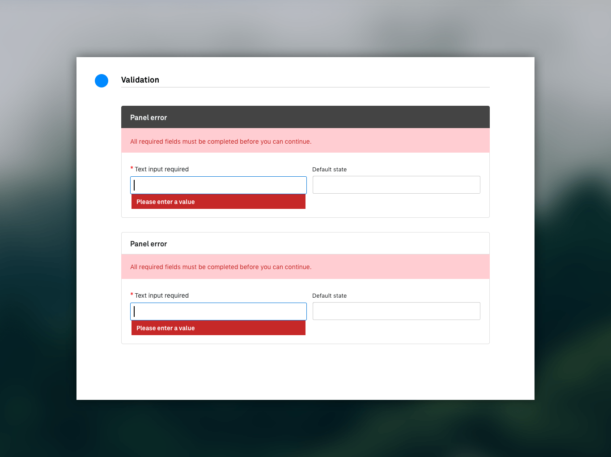
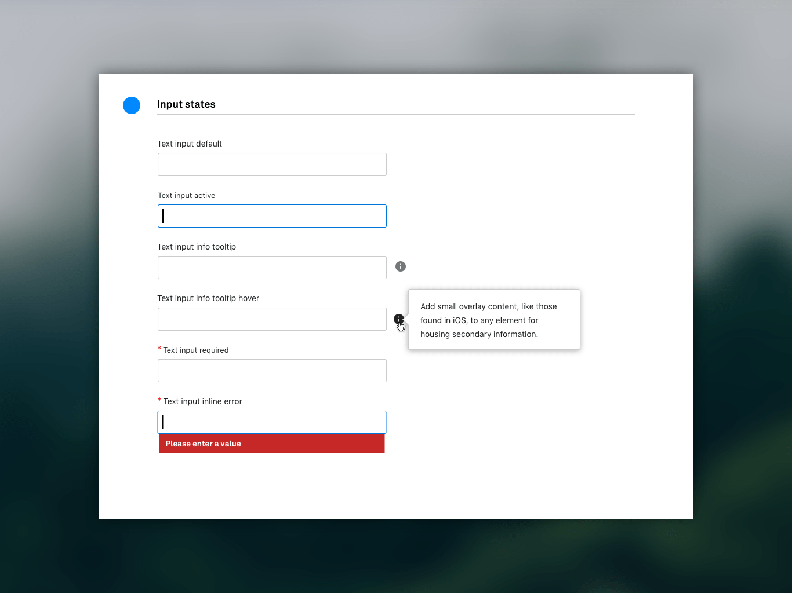
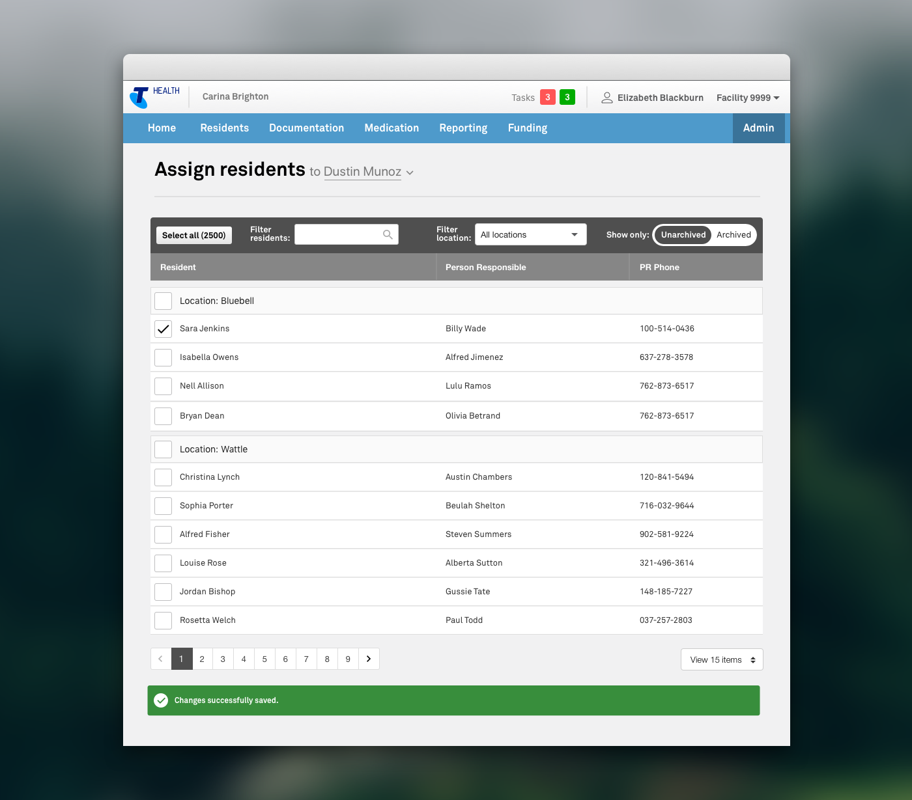

At Telstra Health I developed a design system for designers and developers. I used Patternlab to document UI/UX patterns to promote a consistent experience across web applications and streamline bug fixes and implementation of new features.

<small>Process maps allowed the team to visualise the toolchain and work towards better alignment.</small>

I initiated a design reviews and ran workshops to bridge the gap between designers and developers on working on separate teams. I collaborated with developers removing legacy code and updating with reusable documented components. I refined the visual design, updated legacy pages and components to the Telstra Health branding and created documentation.

<small>Documenting state was critical to maintain consistant approach in error handling and valdation.</small>

<small>New components were gradually introduced as during functional enhancements.

I ran user interviews and user test sessions with carers and administration staff remotely and onsite. I also spent time volunteering at Mayflower Brighton through a volunteer program offered by Telstra Health ADCC. These experiences provided actionalble insights including prefered device types and orientation, app performance and connection speeds, user context and critical edge cases.